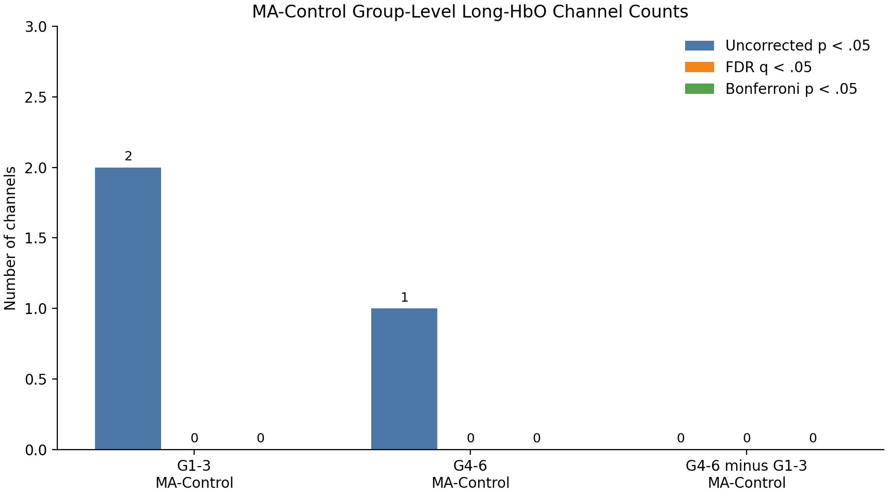
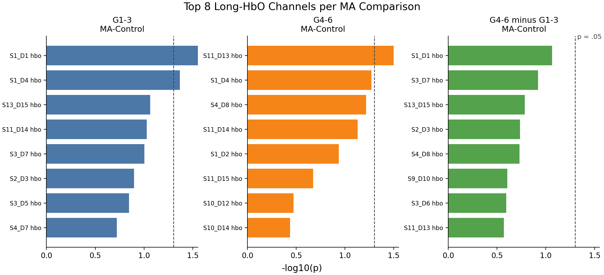
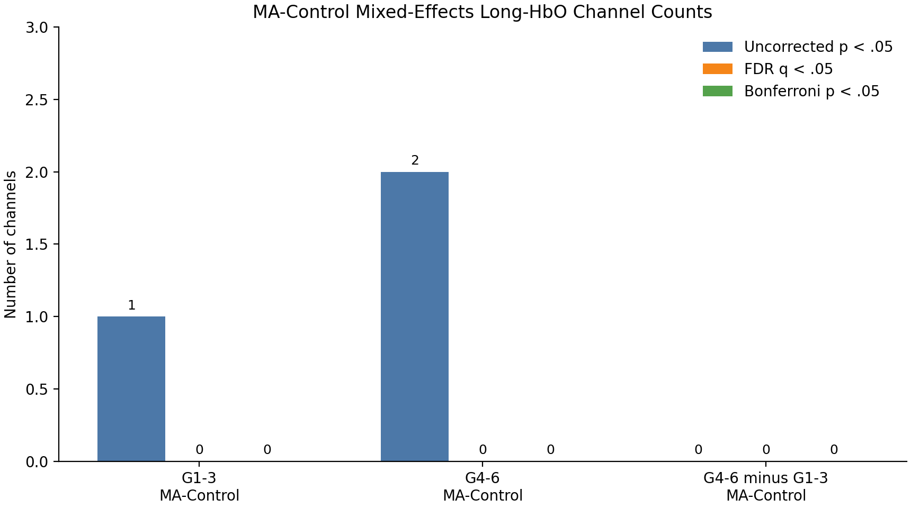
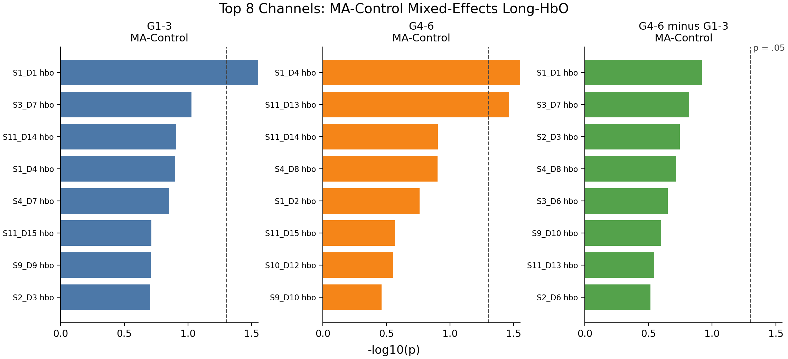
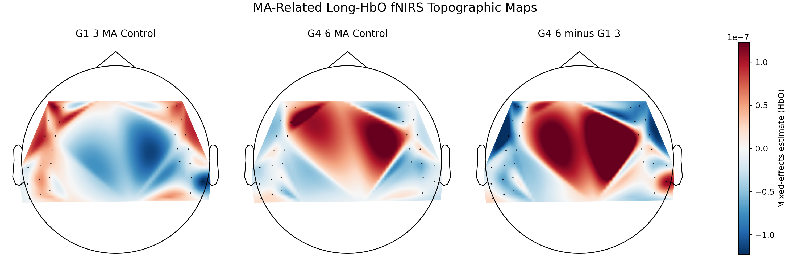

# Final Project Report Draft

## Title

MA-Related fNIRS Brain Activation Differences Between Lower- and Upper-Grade Children

## Project Goal

This project examines morphological awareness (MA)-related brain activation in
children using fNIRS. The main scientific goal is to compare lower-grade
children (Grades 1-3) and upper-grade children (Grades 4-6), focusing on the
`MA-Control` contrast.

The existing analysis workflow was originally implemented in MATLAB with
nirs-toolbox. As the methodological component of this project, an open-source
MNE-Python/MNE-NIRS pipeline is constructed with reference to the MATLAB
workflow. The MATLAB-Python comparison is treated as a validation and
interpretation step, not as the primary research question.

## Research Question

Do lower-grade and upper-grade children show different fNIRS brain activation
patterns during morphological awareness processing?

The main group-level contrast is:

```text
(G4_6 MA - G4_6 Control) - (G1_3 MA - G1_3 Control)
```

## Data

The local dataset contains SNIRF files from 131 child participants.

| Group | Subjects |
| --- | ---: |
| G1_3 | 59 |
| G4_6 | 72 |
| Total | 131 |

The SNIRF event labels were mapped according to the original MATLAB pipeline:

| SNIRF label | Condition |
| --- | --- |
| `1` | `MA` |
| `2` | `PA` |
| `3` | `Control` |

All participants had complete `MA` and `Control` event markers for the current
MA-focused analysis. One participant had 17 `PA` events instead of 16, but this
does not affect the current `MA-Control` analysis.

Raw data and participant-level derivative files are not uploaded to GitHub
because the dataset contains child-participant data.

## Methods: Python and MATLAB Pipelines

The analysis method has two connected components:

1. A Python-based fNIRS pipeline using MNE-Python and MNE-NIRS.
2. A MATLAB/nirs-toolbox reference pipeline used for methodological alignment
   and validation.

The main statistical analysis is conducted in Python for the final project.
The MATLAB workflow is used to identify equivalent preprocessing/modeling
steps and to understand why the two tools may produce different numerical
results.

The MATLAB-Python comparison separates two issues. First, some MATLAB
functions may or may not have direct MNE-Python equivalents. Second, even when
both tools implement the same conceptual preprocessing step, different default
parameters or algorithms may produce different numerical outputs. The current
function mapping and remaining gaps are documented in
`docs/matlab_mne_function_mapping.md`.

## New Skills and Open Science

The main new skill learned in this project is the use of MNE-Python and
MNE-NIRS for fNIRS data analysis. This includes loading SNIRF files,
preprocessing fNIRS signals, estimating subject-level GLM models, constructing
group-level MA contrasts, fitting a MATLAB-like mixed-effects model, validating
MATLAB-vs-MNE preprocessing differences, and generating reproducible result
figures and topographic fNIRS maps.

The project follows an open-science structure by keeping the analysis code,
documentation, and aggregate figures in a public repository. Raw data,
participant-level derivatives, subject information, and local validation
exports are excluded from Git to protect child-participant privacy.

## Python Pipeline

### Data Loading

The pipeline reads SNIRF files using `mne.io.read_raw_snirf`. The loading
script checks event names, event counts, group labels, and basic file metadata.

### Preprocessing

The preprocessing script implements the current MNE-Python preprocessing pass:

1. Load SNIRF raw intensity data.
2. Rename events to `MA`, `PA`, and `Control`.
3. Resample the data to 2 Hz.
4. Convert raw intensity to optical density.
5. Convert optical density to HbO/HbR concentration.
6. Trim the recording to the task window, using 5 seconds before the first
   event and 5 seconds after the last event.

All 131 participants were preprocessed successfully. Thirteen participants
produced an MNE warning about negative intensities during optical-density
conversion. These participants were retained, but the warning should be
reported as a quality-control caveat.

### First-Level GLM

Subject-level GLM analysis was run with MNE-NIRS. The model includes `MA`,
`PA`, and `Control`, while the main contrast is `MA-Control`.

Main settings:

- HRF model: `glover`
- stimulus duration: 10 seconds
- drift model: cosine
- high-pass value: 0.008
- noise model: `ar1`
- short-separation regressors: enabled

The short-separation regressors were added to better align the Python workflow
with the MATLAB/nirs-toolbox pipeline.

### Group-Level Analysis

The group analysis uses each participant's `MA-Control` first-level contrast.
The current statistical analysis is restricted to 32 long-distance HbO channels
to better match the MATLAB analysis focus.

Three channel-level comparisons are computed:

1. `G1_3 MA-Control`: one-sample t-test against 0.
2. `G4_6 MA-Control`: one-sample t-test against 0.
3. `G4_6 minus G1_3 MA-Control`: Welch two-sample t-test.

Multiple-comparison correction is applied separately for each comparison using
FDR and Bonferroni correction.

A second Python group-level analysis fits a MATLAB-like mixed-effects model on
first-level condition betas:

```text
theta ~ -1 + Group:Condition + (1|Subject)
```

This model is used for the final topographic fNIRS maps.

## Preliminary Results

The current Python group-level analysis did not identify corrected significant
long-HbO channels.

| Comparison | Uncorrected p < .05 | FDR significant | Bonferroni significant |
| --- | ---: | ---: | ---: |
| G1_3 MA-Control | 2 | 0 | 0 |
| G4_6 MA-Control | 1 | 0 | 0 |
| G4_6 minus G1_3 MA-Control | 0 | 0 | 0 |

The smallest uncorrected p-values were:

| Comparison | Channel | p | FDR p |
| --- | --- | ---: | ---: |
| G1_3 MA-Control | S1_D1 hbo | 0.004539 | 0.145263 |
| G4_6 MA-Control | S11_D13 hbo | 0.031599 | 0.594439 |
| G1_3 MA-Control | S1_D4 hbo | 0.043052 | 0.634445 |
| G4_6 minus G1_3 MA-Control | S1_D1 hbo | 0.086210 | 0.956130 |

These results are preliminary and should be interpreted cautiously. The Python
pipeline currently provides a reproducible MA analysis workflow, but it does
not reproduce the corrected significant-channel pattern from the MATLAB
pipeline.

## Figures

The project includes aggregate figures for the MA group-level results:











These figures are generated from the group-level summary CSV tables, not from
raw participant-level time series. They can be regenerated with:

```bash
python scripts/visualization.py
python scripts/plot_brain_maps.py
```

The topographic maps were generated with the project-specific script
`scripts/plot_brain_maps.py`. The core visualization function is MNE-Python's
official `mne.viz.plot_topomap` function:

```text
https://mne.tools/stable/generated/mne.viz.plot_topomap.html
```

These maps should be interpreted as fNIRS channel topographic maps based on
the measured optode montage, not structural MRI activation maps.

## MATLAB Comparison and Validation

The original MATLAB/nirs-toolbox analysis used methods that are not identical
to the current MNE-Python implementation. Important differences include:

- MATLAB first-level GLM used AR-IRLS, while the Python pipeline uses `ar1`.
- MATLAB group analysis used a mixed-effects model. A MATLAB-like Python
  mixed-effects model has been added, but solver/default differences may
  remain.
- HRF and model details may differ between nirs-toolbox and MNE-NIRS.
- Some saved MATLAB contrast-table filenames and internal contrast labels
  should be checked before treating the MATLAB significant-channel summary as
  final.

To address the TA's validation question, this project includes a MATLAB export
script and a Python validation script. The validation was completed locally
after exporting MATLAB/nirs-toolbox preprocessed HbO/HbR time series.

Following TA feedback, the validation was revised to first diagnose temporal
alignment and then compare arrays without using interpolation as the primary
validation step. One duplicate MATLAB manifest row was dropped, leaving 131
subjects and 10,480 channel-level comparisons. No subjects had identical
time-grid lengths, only 14 subjects had close common time points, and no
channel was exactly equal or unit-aware `allclose` under the current default
tolerances. The sample-index-aligned median correlation was 0.993, but this is
treated only as a shape diagnostic. The median Python/MATLAB standard-deviation
ratio was 1.67e-08, indicating a large unit/scale mismatch. Therefore, the
current Python preprocessing should not be described as numerically equivalent
to the MATLAB preprocessing.

## Current Interpretation

The current project supports the feasibility of building an MNE-Python fNIRS
pipeline for MA analysis. It successfully loads SNIRF data, performs
preprocessing, runs first-level GLM, and performs group-level MA contrast
testing across 131 participants.

However, the current Python statistical results should not be presented as a
direct numerical replication of the MATLAB/nirs-toolbox results. The project
should instead present the Python workflow as a transparent open-source
pipeline, with MATLAB comparison used to identify methodological differences
and guide further validation.

## Next Steps

1. Report the MATLAB-vs-MNE preprocessing discrepancy as a methodological
   limitation.
2. Investigate likely sources of the scale and waveform differences if time
   permits.
3. Review the local PowerPoint deck visually before presentation.
